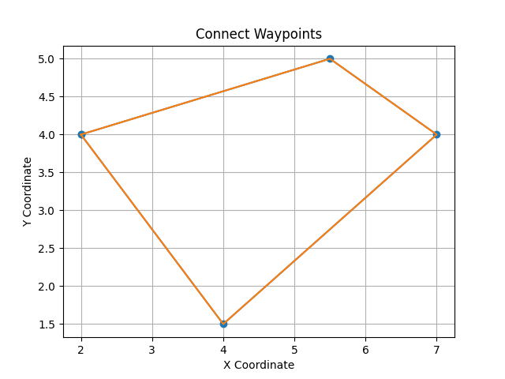
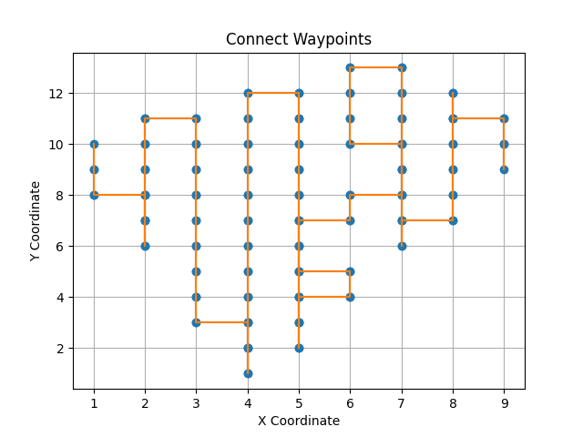

# Repo for simple room cleaning robot

## INSTALLATION 
    mkdir -p ~/Floor_cleaner_ws/src
    cd ~/Floor_cleaner_ws/src
    git clone {this branch}
    pip3 install shapely

### Build
    cd ~/Floor_cleaner_ws
    catkin_make

### Starting robot
    roslaunch robot_gazebo gazebo.launch

### Cleaning complete map
    roslaunch robot_navigation cleaning.launch

### planner testing
To test the planner first set segment to be cleaned using publish point function in rviz to select segment polygon
and run planner_tester.py in robot_global_planner/scripts

### segment for planning

### created plan

